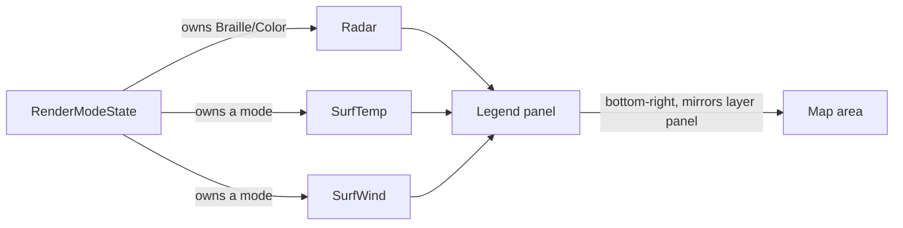

# Map legend — colour scales for the active layers

## Problem

Every colour-carrying layer in `front` encodes a quantity as a hue, and none of
them say so on screen. Radar reflectivity runs through an eleven-stop palette
from light blue to white (`dbz_to_color`, `src/providers/meteogate.rs:1250`);
temperature, wind, humidity and pressure each have their own independent ramp
(`obs_color`, `src/ui.rs:2822`). A user looking at an orange cell has no way to
learn whether that means 45 dBZ, 25 °C, or a 15 m/s gust — the information is
present but the key to reading it lives only in the source.

The layer panel sits bottom-left. The bottom-right corner is unused, and is the
natural home for the reciprocal information: the panel on the left says *what*
is drawn, a panel on the right would say *what the colours mean*.

## Goals / Non-goals

**Goals**

- Show the colour → value mapping for every scale currently visible on the map.
- Match the layer panel's placement convention so the two read as a pair.
- Cost nothing when no colour-carrying layer is active.
- Degrade gracefully on a narrow or short terminal rather than corrupting the map.

**Non-goals**

- Interactivity. The legend is a read-only key; it is not selectable or focusable.
- A legend for the geographic layers. Border colours are categorical
  (`border_line_color`) and self-evident from the map itself.
- Reworking any palette. This documents the existing ramps; it does not change
  them. Palette changes are a separate concern with their own visual review.
- Continuous gradients. The ramps are already banded, and a terminal cell is the
  smallest unit available — a legend row per band is the honest representation.

## What "active" means

This is the crux, and it is already decided by existing machinery rather than
needing a new concept. `RenderModeState` holds one exclusive primary owner per
mode plus a list of overlays (`src/layers.rs`). A scale belongs on the legend
exactly when its layer currently owns a render mode that paints colour:

| Scale | Shown when |
|---|---|
| dBZ | `Radar` owns `Braille` or `Color` |
| Temperature | `SurfTemp` owns a mode |
| Wind | `SurfWind` owns a mode |
| Humidity | `SurfHumidity` owns a mode |
| Pressure | `SurfPressure` owns a mode |

Because the render-mode system already enforces "at most one layer per mode",
the number of simultaneously active scales is bounded by the number of modes —
in practice one or two, not five. That bound is what makes stacking viable.

Which layers contribute a legend block, driven by the existing render-mode ownership.

## Approaches

| # | Approach | Pros | Cons |
|---|----------|------|------|
| A | Stack a block per active scale | Complete; no hidden information; reuses mode ownership directly | Tallest case (radar + an obs layer) needs ~18 rows; must degrade on short terminals |
| B | Primary scale only — whichever owns `Color` | Always one small block; trivial layout | Silently hides the radar key whenever an obs layer owns `Color`, which is the common case and the exact ambiguity the feature exists to remove |
| C | Compact single row per scale, colour swatches only, no numbers | Very small footprint | A swatch strip without numbers is decoration, not a key — it does not answer "what is this orange?" |
| D | Toggleable legend behind a keybinding | Zero cost when unwanted | Adds a binding and a persisted state flag for something that should just be visible; the user asked for a legend, not a legend toggle |

## Recommendation

**Approach A — stack one block per active scale**, with height-driven degradation.

B is rejected on the merits rather than on cost: the ambiguity that motivates
this feature is strongest precisely when two colour layers are on at once, and B
goes silent exactly then. C fails the "does it answer the question" test. D
solves a problem (screen clutter) that the bounded scale count already prevents.

The stacking cost is bounded by the render-mode system, not by the number of
layers: at most one layer owns `Color` and one owns `Braille`, so the realistic
worst case is two blocks — radar plus one observation property.

**Degradation, in order:** when the available height cannot fit every block,
drop whole blocks from the bottom (least-recently-activated scale first) rather
than truncating a block mid-ramp. A half-drawn ramp misleads; an absent one
merely omits. When even one block will not fit, draw nothing. This mirrors the
footer's existing behaviour, which drops hints from the right when narrow
(`keys::footer_hints` ranks by need).

**Placement** mirrors `layer_area` (`src/ui.rs:3239`) exactly, reflected:

| | Layer panel (existing) | Legend (new) |
|---|---|---|
| x | `area.x + 2` | `area.x + area.width - width - 2` |
| y | `area.y + area.height - (1 + height)` | identical |

Same two-column inset, same single row of bottom padding, so the two panels sit
symmetrically on the same baseline.

**Band derivation.** The legend must not restate the thresholds as a second
hardcoded list — two copies of the same eleven boundaries will drift the first
time a palette is touched, and the drift would be invisible (a legend that
disagrees with the map still renders fine). The bands belong next to the colour
functions they describe, exported as data that both the renderer and the legend
read. `dbz_to_color` and `obs_color` become consumers of that table rather than
owners of a threshold chain.

## Resolved — horizontal colour bars (2026-07-22)

The CP-2 → CP-3 gate resolved the layout and both open questions with the user.
The legend is **not** a vertical stack of banded rows. Each active scale is a
**compact horizontal colour bar**:

- **Orientation:** horizontal. Low → high runs left → right.
- **Colour source:** the discrete band colours from the CP-1 tables, laid
  edge-to-edge as cell **background** colours. No interpolation — the bar shows
  the exact colours the map paints; it reads as a near-continuous gradient only
  because each band spans several cells. This keeps the earlier "no continuous
  gradients" non-goal honest while giving the smooth look the user wanted.
- **Width:** every bar shares one fixed width so the bars align into a neat
  column regardless of how many bands each scale has (dBZ 10, obs 5–6). Labels
  are positioned by fraction along that fixed width.
- **Layout (two rows per scale):** row 1 (top) is the `name / unit` title on the
  left (`Reflect / dBZ`, `Temp / °C`, `Wind / m/s`, `Humid / %`, `Press / hPa` — a
  slash not parentheses, the scientific quantity/unit axis convention) followed
  INLINE by the gradient bar (the colour scale on the title's row). Row 2 (bottom)
  is the numbers, aligned under the bar, each drawn in the colour of the band it
  marks (its tick colour) so it reads as belonging to that point on the gradient
  above it. Blocks left-align in a fixed title column so the bars begin at the same
  x. Numbers are an evenly-spaced (uniform-stride) subset of the band boundaries
  (low/high always kept); the bar is kept compact. Several rendered-legend reviews
  (2026-07-22) drove this shape: numbers on their own row above a separate bar made
  it hard to tell which tick a number belonged to, so the bar moved inline with the
  title and each number took its band's colour.
- **Bar (sub-character gradient):** rendered with half-block glyphs at 2× horizontal
  resolution — each terminal cell carries two band colours (foreground + background
  halves), so band edges fall at half-cell granularity and the bar reads as a finer,
  smoother gradient than chunky full-cell segments. Still only the discrete band
  colours (no interpolation) — every band occupies the same fixed number of
  half-cells, so segments stay uniform.
- **Labels:** only the start and end values, placed beside the bar (not over it) on
  row 2. An earlier rendered-legend review showed interior labels collide/merge on a
  narrow bar (`560+`, `2030+`), so interior labels stay dropped; the gradient carries
  the middle.

**Degradation** is now fixed-priority, not recency-based: keep the radar (dBZ)
bar, drop observation bars first, always whole bars, never partial. Rationale:
each bar is only a few rows tall so the height budget is rarely tight, and no
activation-recency state exists in `RenderModeState` (primary mode slots are bare
`Option<LayerId>` with no activation order). `active_scales` already returns
dBZ-first declaration order, so "drop from the tail" implements this directly.

Placement (`legend_area`, bottom-right mirror of `layer_area`) and the
band-derivation principle below are unchanged by this reshape.

## Original open questions (resolved above)

- Should the dBZ block show every one of the eleven bands, or condense to the
  labelled decades (5/15/25/35/45/55/60+)? — Resolved: the full scale renders as
  one horizontal bar, so row-count is no longer the constraint.
- Does the legend need a unit suffix per block as a header row, or is the layer
  name enough? — Resolved: name column + sparse labels carry the unit; no
  separate header row.
