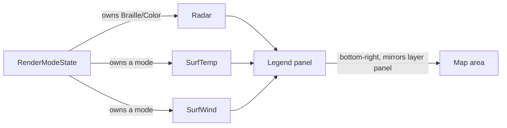

# Map legend — colour scales for the active layers

## Problem

Every colour-carrying layer in `front` encodes a quantity as a hue, and none of
them say so on screen. Radar reflectivity runs through an eleven-stop palette
from light blue to white (`dbz_to_color`, `src/providers/meteogate.rs:1250`);
temperature, wind, humidity and pressure each have their own independent ramp
(`obs_color`, `src/ui.rs:2822`). A user looking at an orange cell has no way to
learn whether that means 45 dBZ, 25 °C, or a 15 m/s gust — the information is
present but the key to reading it lives only in the source.

The layer panel sits bottom-left. The bottom-right corner is unused, and is the
natural home for the reciprocal information: the panel on the left says *what*
is drawn, a panel on the right would say *what the colours mean*.

## Goals / Non-goals

**Goals**

- Show the colour → value mapping for every scale currently visible on the map.
- Match the layer panel's placement convention so the two read as a pair.
- Cost nothing when no colour-carrying layer is active.
- Degrade gracefully on a narrow or short terminal rather than corrupting the map.

**Non-goals**

- Interactivity. The legend is a read-only key; it is not selectable or focusable.
- A legend for the geographic layers. Border colours are categorical
  (`border_line_color`) and self-evident from the map itself.
- Reworking any palette. This documents the existing ramps; it does not change
  them. Palette changes are a separate concern with their own visual review.
- Continuous gradients. The ramps are already banded, and a terminal cell is the
  smallest unit available — a legend row per band is the honest representation.

## What "active" means

This is the crux, and it is already decided by existing machinery rather than
needing a new concept. `RenderModeState` holds one exclusive primary owner per
mode plus a list of overlays (`src/layers.rs`). A scale belongs on the legend
exactly when its layer currently owns a render mode that paints colour:

| Scale | Shown when |
|---|---|
| dBZ | `Radar` owns `Braille` or `Color` |
| Temperature | `SurfTemp` owns a mode |
| Wind | `SurfWind` owns a mode |
| Humidity | `SurfHumidity` owns a mode |
| Pressure | `SurfPressure` owns a mode |

Because the render-mode system already enforces "at most one layer per mode",
the number of simultaneously active scales is bounded by the number of modes —
in practice one or two, not five. That bound is what makes stacking viable.

Which layers contribute a legend block, driven by the existing render-mode ownership.

## Approaches

| # | Approach | Pros | Cons |
|---|----------|------|------|
| A | Stack a block per active scale | Complete; no hidden information; reuses mode ownership directly | Tallest case (radar + an obs layer) needs ~18 rows; must degrade on short terminals |
| B | Primary scale only — whichever owns `Color` | Always one small block; trivial layout | Silently hides the radar key whenever an obs layer owns `Color`, which is the common case and the exact ambiguity the feature exists to remove |
| C | Compact single row per scale, colour swatches only, no numbers | Very small footprint | A swatch strip without numbers is decoration, not a key — it does not answer "what is this orange?" |
| D | Toggleable legend behind a keybinding | Zero cost when unwanted | Adds a binding and a persisted state flag for something that should just be visible; the user asked for a legend, not a legend toggle |

## Recommendation

**Approach A — stack one block per active scale**, with height-driven degradation.

B is rejected on the merits rather than on cost: the ambiguity that motivates
this feature is strongest precisely when two colour layers are on at once, and B
goes silent exactly then. C fails the "does it answer the question" test. D
solves a problem (screen clutter) that the bounded scale count already prevents.

The stacking cost is bounded by the render-mode system, not by the number of
layers: at most one layer owns `Color` and one owns `Braille`, so the realistic
worst case is two blocks — radar plus one observation property.

**Degradation, in order:** when the available height cannot fit every block,
drop whole blocks from the bottom (least-recently-activated scale first) rather
than truncating a block mid-ramp. A half-drawn ramp misleads; an absent one
merely omits. When even one block will not fit, draw nothing. This mirrors the
footer's existing behaviour, which drops hints from the right when narrow
(`keys::footer_hints` ranks by need).

**Placement** mirrors `layer_area` (`src/ui.rs:3239`) exactly, reflected:

| | Layer panel (existing) | Legend (new) |
|---|---|---|
| x | `area.x + 2` | `area.x + area.width - width - 2` |
| y | `area.y + area.height - (1 + height)` | identical |

Same two-column inset, same single row of bottom padding, so the two panels sit
symmetrically on the same baseline.

**Band derivation.** The legend must not restate the thresholds as a second
hardcoded list — two copies of the same eleven boundaries will drift the first
time a palette is touched, and the drift would be invisible (a legend that
disagrees with the map still renders fine). The bands belong next to the colour
functions they describe, exported as data that both the renderer and the legend
read. `dbz_to_color` and `obs_color` become consumers of that table rather than
owners of a threshold chain.

## Open questions

- Should the dBZ block show every one of the eleven bands, or condense to the
  labelled decades (5/15/25/35/45/55/60+)? Eleven rows is tall next to a
  five-row temperature block. Leaning condensed, but this is a visual judgement
  better made against a rendered mock than argued in prose.
- Does the legend need a unit suffix per block (`dBZ`, `°C`, `m/s`, `%`, `hPa`)
  as a header row, or is the layer name enough? A header row costs one row per
  block against the height budget.
