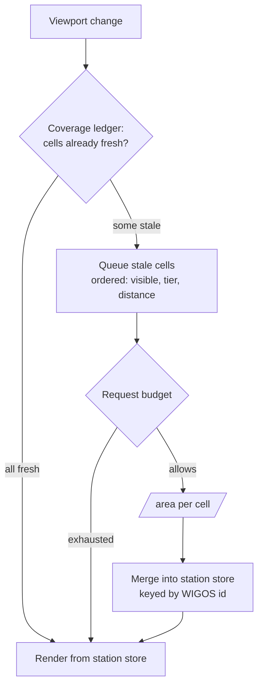

# Observation tiering — priority, freshness, and the request budget

## Problem

The requested behaviour is: *major cities first, then minor cities, then smaller
locations; prioritise what is currently visible; and on a zoom change, diff
rather than refetch.*

Taken literally — one request per city, ordered by importance — this is
infeasible. The MeteoGate gateway allows an anonymous client **50 requests per
hour**; the city list is 113 points (45 capitals in `EUROPEAN_CAPITALS` plus 68
in `EUROPEAN_MAJOR_CITIES`, `src/geo.rs`). A single full pass at one request per
city is **more than two hours of the entire allowance**, leaving nothing for the
viewport. Even with an API key (500/hour) one pass consumes ~23% of the hour, so
any TTL under ~20 minutes still busts the budget. Per-city fetching is not a
tuning problem; it does not fit.

The requirement survives anyway, because it was never really about fetching. An
`/area` query returns **every** station inside its polygon. So:

| Requirement | Where it actually lives | Request cost |
|---|---|---|
| "major, then minor, then smaller" | which stations get *labels* at a zoom — already `clip_layer_by_density` | zero |
| "prioritise currently visible" | the *order* cells are queried | zero |
| "diff, don't refetch on zoom" | cache *identity* — see below | negative |

Fetch granularity and display granularity are separate axes. Conflating them is
what made the requirement look impossible.

## Goals / Non-goals

**Goals**

- Viewport stations resolve first, and stay first, at any zoom.
- Importance ordering (capital → major city → other) governs both query order and
  label priority.
- A zoom change reuses everything still valid and fetches only the remainder.
- Total request volume stays inside the anonymous 50/hour quota, with the key
  case getting more coverage rather than a different design.

**Non-goals**

- Per-city requests, at any quota. Stated plainly so it is not re-proposed.
- Changing the palette, thinning rules, or label layout.
- A new data source. "Smaller locations" means stations already present in
  responses and thinned away for legibility, not a network `front` doesn't query.

## Bugs this design must fix

Found while grounding this plan; each is independently wrong today.

| # | Bug | Evidence | Effect |
|---|---|---|---|
| 1 | The regional backdrop is fetched at **every** zoom, ungated, while the viewport query is gated to `zoom >= CAPITALS_ZOOM_CUTOFF` | `eumetnet.rs:390` gates the viewport task; the `fetch_location_batch` call at `:438` has no gate | Zoomed in you pay ~16 continental cell queries whose stations are off-screen, *plus* the viewport query. Largest single source of budget waste. |
| 2 | `CAPITALS_ZOOM_CUTOFF = 5.5` but `MAJOR_CITIES_ZOOM_CUTOFF = 5.0`, despite a comment on each saying they must match | `eumetnet.rs:88`, `ui.rs:59` | A half-zoom band where the fetch tier and the display tier disagree |
| 3 | `station_id` is the station *name*, falling back to the WIGOS id when the name cache is cold | `eumetnet.rs:727-733` | Dedup identity changes as the name cache warms — the same station is two identities across a session. Blocks per-station caching outright. |
| 4 | `location_cache` is memory-only; nothing loads or saves it | `eumetnet.rs:226`, `:253` | `CAPITAL_DATA_TTL = 6 h` actually means "6 h or until quit". Every launch re-pays the full backdrop. |
| 5 | `fetch_station_list` never calls `try_spend` | no `try_spend` in that function | The 24 h `/locations` fetch is invisible to the budget, so the budget is not a total |

Bug 1 alone frees most of the anonymous allowance and is the smallest diff here.

## Approaches

| # | Approach | Requests / full pass | Delivers tiering | Cons |
|---|----------|---|---|---|
| A | Per-city 1° boxes (the literal ask) | 113 | yes | 2.3× the entire hourly quota; already caused permanent 429s |
| B | Keep 12° cells, re-sort by importance + viewport overlap | ~16 cold, ~0 warm | yes (ordering) | Coarse cells; cache still geometry-keyed |
| C | Fixed quadtree lattice (12° → 3° → 0.75°), depth chosen by remaining budget | 1–3 anon, 8–20 keyed | yes | Real machinery; only pays off with a key |
| D | Per-station store + coverage ledger | fetches only uncovered area | yes | Needs stable station identity (bug 3) first |

## Recommendation

**B + D, sequenced, with the bug fixes first. C only if wanted later.**

The ordering matters more than the individual choices:

1. **Fix bugs 1 and 2.** Gate the backdrop to `zoom < CUTOFF` and make the two
   cutoffs one shared constant. No cache-model change, no new concepts, and it
   recovers most of the budget on its own.
2. **Re-sort cells (B).** Replace the pure centre-distance sort at
   `eumetnet.rs:426-440` with
   `(overlaps_viewport desc, best_city_tier_inside asc, distance_from_centre asc)`.
   Cell *geometry* is unchanged, so every existing cache key stays valid — this
   is the user's requirement at zero request cost and near-zero risk.
3. **Fix bug 3, then split the cache (D).** Carry the WIGOS id as its own field
   on `ObservationPoint` and dedup on it. Then separate:
   - a **station store** keyed by WIGOS id — geometry-independent, disk-backed.
     This is the data; zoom and pan never invalidate it, and rendering is a
     filter over it.
   - a **coverage ledger** keyed by cell — what area was fetched, and when. Only
     this is geometry-tied, and losing it costs freshness, not pixels.

   This is what makes "diff, don't refetch" true by construction, and it is the
   same principle recorded in `docs/design/zoom-stable-caching.md`: **cache by
   what the data is, not by how it was requested.**

C is deferred. It turns geometry into a lattice so a viewport maps to a
deterministic cell set and zoom-in reuses the parent cell as an instant backdrop
— genuinely nice, but it only buys resolution the anonymous budget cannot afford
anyway. Revisit if an API key is configured and step 3 still leaves the map too
coarse.

A is rejected permanently.

Fetch decisions read the ledger; rendering reads the store. Only the ledger is tied to geometry.

## The freshness hazard

The store/ledger split has one serious failure mode, and it must be designed
against rather than discovered: the map shows stations everywhere while their
readings are quietly hours old, because the ledger says "covered" and the budget
never permits a refresh. Today the layer fails *visibly* (points missing);
afterwards it would fail *invisibly* (points stale).

Two mitigations, both mandatory rather than polish:

- A hard age cap on stored readings — beyond it a station is dropped, not shown
  stale. The query window is already `now-1h .. now` (`eumetnet.rs:684-689`), so
  ~90 minutes is the natural ceiling.
- Reading age surfaced in the UI, because after this change a single view can
  legitimately mix stations fetched minutes and hours apart.

A per-station store also grows without bound where the current single-file cache
did not, so it needs a size cap and a bounded on-disk format.

## Open questions

- **Does one `/area` over a 12° cell really return every station, and how big is
  the response?** Never measured. The only sizing note in-code is the
  continent-scale "tens of MB, ~40 s" at `eumetnet.rs:386`. If the gateway caps
  or paginates responses, coarse cells silently lose exactly the small stations
  this design promises to tier — and the whole recommendation inverts toward
  finer units and a mandatory API key. **This is the assumption most worth
  testing before implementing step 3.**
- Is the quota per-IP-global or per-key-per-endpoint? The arithmetic above
  assumes per-IP.
- ~~Should the backdrop survive restart (bug 4)?~~ **Resolved: yes.** Against a
  50/hour quota, re-paying the full backdrop on every launch is a cost nobody
  chose, and the age cap below already bounds the staleness that persistence
  would otherwise introduce. The station store is disk-backed with a bounded
  size; see `docs/spec/observation-tiering.md` checkpoint 4.
- Are WIGOS ids stable across responses, and do station positions ever move?
  Step 3 depends on both.
