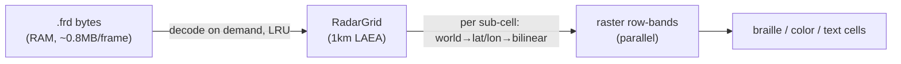

# Radar: direct source-grid resampling

## Problem

Radar renders through a Web-Mercator tile pyramid: per frame, `build_tile`
rasterises 256×256-pixel tiles from the 1 km LAEA source grid, caches them
(`frame_cache`), streams them centre-first, evicts and rebuilds them on zoom,
and preloads a window. The terminal map is only ~80k braille sub-cells, so the
pipeline builds millions of tile pixels per frame and throws almost all of them
away downsampling into the screen. Consequences the user hit:

- **Blocky when zoomed in** — a fixed tile zoom paints flat, band-quantised
  cells; magnifying them shows hard rectangles no field-smoothing hides.
- **Jumpy on pan/zoom** — crossing coverage/zoom boundaries rebuilds tiles.
- **Costly** — built tiles dominate radar RAM and CPU.

The source grid is 1 km (`3800×4400` cells), already decoded to RAM and cached
on disk as compact `.frd` (~0.8 MB/frame). It is the max-precision base; the
tiles are an expensive middleman sized for a browser, not a terminal.

## Goals / Non-goals

- Goals: smooth radar at every zoom; no rebuild/flash on pan or zoom; lower RAM
  and CPU; parallel render; a net deletion, not a new subsystem.
- Non-goals: change the S3 download or `.frd` on-disk format; add an on-disk
  *resampled* cache (rebuild-live is faster); touch borders/obs/warnings; change
  timeline/playback UX.

## Approach

For each screen sub-cell, project screen → world → lat/lon
(`world_to_lat_lon`, `geo.rs:447`) and bilinearly sample the in-RAM source grid
(`sample_bilinear`, already added) → dBZ → band colour (`dbz_to_color`). Zoom
and pan change only *which* lat/lons are sampled — nothing rebuilds, so every
frame is a complete, adaptive, smooth resample. The raster already splits rows
into disjoint parallel bands; sampling drops straight into that structure.

| # | Approach | Pros | Cons |
|---|----------|------|------|
| A | **Direct source→screen resample** (chosen) | Adaptive + smooth + no-flash by construction; ~80k samples/frame vs millions; deletes tile build/cache/preload/spiral; tiny RAM (`.frd` bytes). | Two projections per sub-cell (mercator⁻¹ + LAEA); reference test fixture rewrite. |
| B | Adaptive tile-zoom + no-flash swap | Keeps familiar tile path. | Keeps the middleman causing the jumpiness and RAM; more code than A. |
| C | Raise fixed tile zoom | One line. | Zoomed-out RAM/CPU explode; still blocky past the level. |

## Recommendation

**A.** It is the user's "biggest zoom as base, resampled" idea with the fat
removed: the base *is* the source grid, the resample is per-pixel bilinear, and
"rebuild live" beats a resampled disk cache at terminal resolution. Less code
than the status quo.

Playback keeps frames warm by caching compact `.frd` bytes in RAM for the window
(~0.8 MB × window) and decoding to grids on demand behind a small LRU — not
caching expanded 16.7 MB grids or built tiles.

## Open questions

- None blocking. Per-sub-cell projection cost is the one thing to measure; the
  parallel row-bands and the tiny sample count make a regression unlikely, and
  the help-modal RAM readout plus a render bench gate it.
