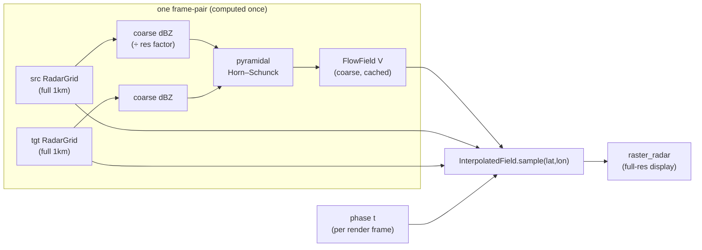

# Radar frame interpolation (optical-flow smoothing)

## Problem

Radar playback steps discretely: one composite every 5 min, shown for a fixed
interval then hard-swapped. Fast-moving systems jump across the screen frame to
frame. The user wants playback to look like continuous motion — storms gliding,
not teleporting — while keeping the real composites pixel-crisp.

The naive fix (cross-fade/dissolve) makes precipitation fade in place rather
than move, which reads as double-exposure ghosting on fast systems. True
smoothing requires estimating how precipitation *moves* between two frames and
advecting it, while still cross-fading intensity so storms that grow or decay in
place don't smear.

## Goals / Non-goals

**Goals**
- Continuous, constant-velocity motion during `Playing` animation between
  consecutive real frames.
- Ground-truth composites always displayed at full 1 km resolution.
- Brightness consistency: growth/decay handled without ghosting.
- CPU-only, no new dependencies, no GPU.
- User-tunable cost via a flow-resolution setting; smoothing on by default.

**Non-goals**
- No extrapolation / prediction / nowcasting — interpolation strictly between
  two existing frames.
- No morphing across the ring seam (newest→oldest wrap stays a hard cut).
- No smoothing of manual `[`/`]` stepping or the live view — animation only.
- No full-resolution flow field (memory cliff; no 1 km-scale motion signal).
- No settings keybind — the modal toggle is the only surface.

## Concept

Between an older frame `src` and the next-newer frame `tgt`, estimate a dense
motion vector field `V` (displacement in grid cells over one frame interval).
For a sub-frame phase `t ∈ [0,1)`, sample **both** real frames at back-projected
positions and blend in linear reflectivity Z:

```
z_src = src.sample_z( p - t·V(p) )       // where this parcel was at src
z_tgt = tgt.sample_z( p + (1-t)·V(p) )   // where it will be at tgt
z     = (1-t)·z_src + t·z_tgt            // temporal cross-fade
```

Backward-warping both sides is gap-free. The Z cross-fade is the
brightness-consistency mechanism: where flow is ~0 (a cell intensifying in
place) the amplitude still fades between the two frames, so growth/decay never
ghosts.

`V` is estimated once per **frame-pair** — it is constant across every
sub-frame of that pair, only `t` advances. So flow is computed just-in-time when
a pair is first reached, cached, and reused for all ~15–60 rendered sub-frames.

### Two resolutions, deliberately decoupled

The **display** is always full resolution: the warp samples the real
`RadarGrid`s via the existing `sample_bilinear_at`. Only the **motion vector
field** is coarse. Precip motion is spatially smooth (a system advects as a
coherent blob), so a coarse `V` bilinearly upsampled produces a visually
full-res warp. Coarse flow ≠ blurry picture.

Coarse flow is also *fast* for a bandwidth reason, not just fewer cells: at 1/4
resolution the working set (~1 M cells) is L2/L3-cache resident, where bandwidth
is an order of magnitude over main memory. Horn–Schunck is a memory-bandwidth-
bound stencil; keeping it in cache is where the milliseconds come from.



## Approaches

Flow algorithm:

| # | Approach | Pros | Cons |
|---|----------|------|------|
| A | Pyramidal Horn–Schunck (pure Rust) | Dense, smooth field ideal for precip; ~80 LOC; captures 5–15 cell displacement via coarse-to-fine warping; no deps | Iterative; needs a small image pyramid |
| B | Single-scale Horn–Schunck | Simplest | Only resolves ~1 cell/iter motion — misses fast systems entirely |
| C | Block-matching / phase correlation | Handles large displacement | Blocky field, needs upsample smoothing, more tuning |
| D | OpenCV Farnebäck | Battle-tested | Large C dependency — fails the no-new-deps / simplicity constraint |

Full-res vs coarse flow, and GPU offload, were evaluated and rejected: full-res
flow is 134 MB/pair (multi-GB across the playback window) and estimates motion
that physically isn't there; GPU is the only lever that speeds full-res (memory
bandwidth, not FLOPs) but adds a large cross-platform dependency for zero visible
gain once flow is coarse. See the conversation record; both are out of scope.

## Recommendation

**A — pyramidal Horn–Schunck**, backward-warp-both-and-blend sampler, coarse
per-pair flow cached in a small bounded LRU, warmed a pair ahead via the
existing `trigger_field_preload` hook. Flow resolution is a user setting.

Rationale grounded in the codebase:
- The renderer already takes radar through a single sampler closure
  (`ui.rs:2091`, `raster_radar`) — an interpolated field is a different closure,
  no render-path change.
- `RadarGrid::sample_bilinear_at` already samples fractional grid coords and
  blends in linear Z (`meteogate.rs:841`) — the warp reuses it and inherits the
  correct Z-space math.
- `playback_step` already treats the `0 → len-1` wrap as a distinct branch
  (`app.rs:2409`) and the newest frame already gets a `base*3` dwell — the seam
  hard-cut falls out naturally.
- Frame preloading (`trigger_field_preload`, `app.rs:828`) already warms a
  window of frames ahead of the playhead — flow warming rides the same trigger.
- The settings modal + `apply_config_edits` already persist config-driven prefs
  to `config.toml`; adding a `[playback]` section fits the existing pattern.

### Memory budget

| Flow resolution | Cell factor | Vector spacing | Bytes/pair |
|---|---|---|---|
| Coarse | 1/8 | ~8 km | ~2 MB |
| Medium (default) | 1/4 | ~4 km | ~8 MB |
| Fine | 1/2 | ~2 km | ~33 MB |

Flow-LRU bounded to a handful of pairs (tighter than the 36-frame preload
window): even Fine stays ~130 MB.

### Settings model gap

The settings modal (`settings.rs`) supports only `FieldKind::Bool` and
`Secret`; `ConfigEditValue` is `Str`/`Bool`. The 3-way resolution choice needs a
new `FieldKind::Choice` (cycles a fixed option list), persisted as a string.
This is an isolated, cohesive addition.

## Open questions

- None blocking. Default flow resolution (Medium) and the exact Horn–Schunck
  iteration/pyramid-level counts are tunables the implementer sets from the
  quality/cost tradeoff and can adjust after visual testing without a spec
  amendment.
