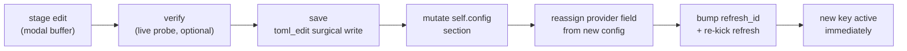

# In-TUI config editor with live verification

## Problem

Every API key that raises a service quota lives in `config.toml`, editable only
by quitting front, finding the file under `~/.config/front/`, hand-editing TOML,
and relaunching — with no feedback on whether the key you pasted actually works.
The observation layer in particular runs against a 50 req/hour anonymous quota
that a MeteoGate key lifts to 500; making that key easy to enter *and confirm*
from inside the app is the payoff.

Users should open a modal (same visual family as the help overlay), edit the
secrets and a few preferences in place, verify each secret against its live
service, and have a valid key take effect immediately — no restart, no manual
file editing.

## Goals / Non-goals

**Goals**
- Edit the quota-raising secrets and non-endpoint preferences from a TUI modal.
- Actively *verify* each secret against its own service (valid / invalid /
  unreachable), surfaced through the existing task overlay.
- Persist edits to `config.toml` preserving comments, ordering, and hand-added
  keys.
- Apply a saved key live — rebuild the affected provider in place so the new
  quota/auth is active without a restart.
- Mask secrets on screen; never log a key value.

**Non-goals**
- Editing service endpoints, S3 endpoint/bucket, or broker URLs. Each is
  API-specific, not a user preference — wrong values break a provider silently.
- The `meteoalarm` section (token + `mqtt_broker`). Deferred while MeteoAlarm /
  MQTT live-update work is parked (see `mqtt-documented-not-implemented`).
- A general settings framework beyond the field set below.
- Editing `state.toml` (runtime state — already adjusted by in-app keys).

## Editable field set (v1)

| Section | Field | Type | Verify | Notes |
|---|---|---|---|---|
| `meteogate` | `api_key` | secret | yes | Authed ORD REST request; lifts radar/tile limits. |
| `eumetnet` | `api_key` | secret | yes | Authed `/locations` (or tiny `/area`) hit; 50→500 req/h. |
| `location` | `ip_fallback` | bool | — | Privacy toggle; the one clear preference today. |

Field *types* (secret string / bool) are the extension seam: a new preference is
a new row, not new machinery. The modal must handle both from day one.

## Verification contract

Each secret has a probe that classifies into one outcome:

| Outcome | Meaning | Signal |
|---|---|---|
| `Valid` | Service accepted the key (2xx to an authed request). | green |
| `Invalid` | Service rejected it (401/403). | red |
| `Unreachable` | Network error / timeout / non-auth 5xx — can't tell. | amber |

- The probe uses the **staged** value in the editor, so you verify *before*
  saving.
- Probes run as background tasks (`TaskMsg` on the existing `task_tx`), rendered
  as an indeterminate marquee (`fraction: None`) in the overlay — no fourth
  ad-hoc spinner.
- Anonymous access already works, so an empty secret is a valid state, not an
  error; verify is only meaningful when a value is present.

## Apply model — live rebuild

Providers are plain `Clone` fields on `App` (`self.meteogate`, `self.eumetnet`),
each cloned into its spawned refresh tasks. Config lives once on `self.config`.
Applying an edit:

The `refresh_id` staleness mechanism already discards results from superseded
tasks, so re-kicking after the swap needs no new cancellation code: the
in-flight fetch's result is dropped on id mismatch, and the next fetch uses the
rebuilt provider.

## Approaches

Write-back and apply are settled by the planning answers; the table records the
forks that were weighed.

| # | Dimension | Chosen | Rejected | Why |
|---|---|---|---|---|
| A | Write-back | `toml_edit` surgical in-place | Reuse `write_default` template | Template regen discards user comments/hand-added keys; `toml_edit` is already in the tree (via `toml 0.8`), updates only changed keys. |
| B | Apply | Live provider rebuild | Save + restart to apply | User chose immediacy; the `refresh_id` mechanism makes mid-session swap cheap and safe. |
| C | Verify transport | Existing task overlay | New ad-hoc spinner | Overlay already supports indeterminate tasks; one consistent surface. |
| D | Endpoint editing | Excluded | Editable endpoints | Each endpoint targets a distinct API; a wrong value silently breaks a provider — not a user knob. |

## Recommendation

Modal in the help visual family (`Clear` + `Block` + `Paragraph`, centered),
owning the keyboard while open exactly as the `/` search prompt does
(`ui.rs:527` runs before `keys::resolve`). A vertical focus list of typed
fields; secrets masked to `set ••••1234` / `unset`; a verify key runs the probe
on the focused secret's staged value; save writes changed keys via `toml_edit`,
mutates `self.config`, rebuilds affected providers, and re-kicks their refresh.

## Resolved decisions

- **Startup viewport** — excluded from v1. Set by panning (saved to `state.toml`);
  numeric-float input isn't worth a third field type.
- **Reveal toggle** — yes, per focused field only; un-focusing re-masks.
- **Save granularity** — save-all-changed on one confirm; Esc discards. A minimal
  diff of pending changes (changed fields only, secrets masked) is shown before
  apply.
- **Future bool preferences** (e.g. auto-recenter-on-location) — the field model
  handles bool fields generically so new toggles are data-only additions; each
  new setting's runtime behavior wiring is follow-on, not part of this editor.

## Open questions

- **Open key.** User suggested `s`. Needs a conflict check against `keys.rs`
  bindings before it's fixed (handled in CP-5).
